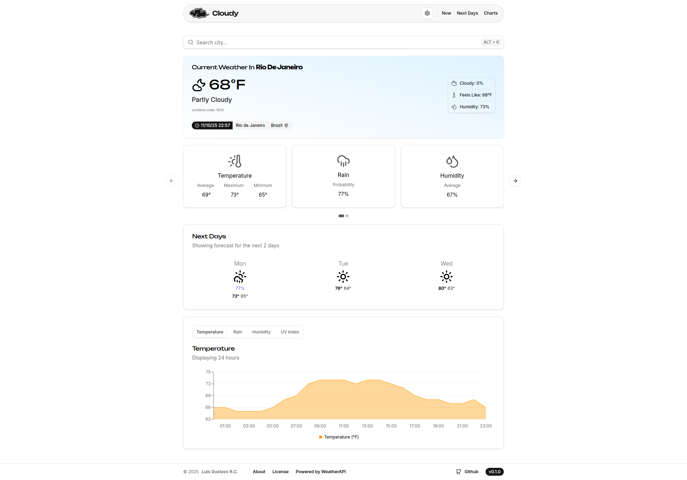
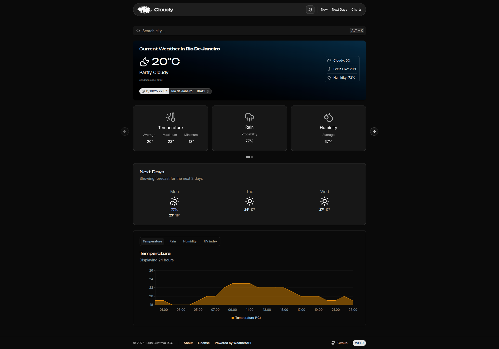

[](#)

<h1 align="center">☁️ Cloudy: weather forecast</h1>

[](./LICENSE.txt)
[](#)
[](#)

Cloudy is a modern weather forecast website built with **React**, **TypeScript**, and **shadcn/ui**. This repository contains only the front-end; you'll need to set up your own back-end to provide weather and geolocation data.

## Demo
[](#)
[](#)

## Features

- Interactive charts for temperature, precipitation, humidity, and UV index
- Detailed forecast with highs, lows, and rain/snow probability
- Highly configurable via [config.json](./public/config.json)
- Light/dark theme support with real-time automatic detection

## Installation

```bash
$ git clone https://github.com/spantalho/cloudy.git
$ cd cloudy
$ yarn install
```

## Configuration

1. Create a `.env` file in the project root:

```env
VITE_SITE_URL=https://really-cool-weather-site.com

VITE_APP_NAME=Weather Website
VITE_APP_ENV=development

VITE_API_BASE_URL=https://ur-api.example.com
```

2. (Opcional) Adjust settings in `public/config.json`

```json
{
  "FEATURES": {
    "functionality": {
      "location_auto_detect": true,
      "theme_auto_detect": true
    }
  }
}
```

3. Start the development server:

```bash
yarn dev
```

## API Contract

The back-end must implement the following endpoints:

### Essential Endpoints

| Method | Endpoint                                      | Description                     |
| ------ | --------------------------------------------- | ------------------------------- |
| `GET`  | `/weather/current?city=<name>`                | Returns current weather         |
| `GET`  | `/forecast?city=<name>&days=<n>&hours=<bool>` | Returns forecast                |
| `GET`  | `/search?q=<query>`                           | Search cities                   |
| `GET`  | `/search/ip`                                  | IP-based geolocation (optional) |

### Response Examples

**`/weather/current`**

```json
{
  "location": {
    "name": "São Paulo",
    "tzId": "America/Sao_Paulo",
    "lat": -23.55,
    "lon": -46.63
  },
  "current": {
    "lastUpdated": "2025-11-10 15:00",
    "temp": { "c": 25.4, "f": 40 },
    "condition": {
      "text": "Partly cloudy",
      "code": 1003
    }
  }
}
```

> Complete examples for this and other endpoints are available in `/src/mocks/`

## Usage Examples (CURL)

```bash

# Current weather
curl "$VITE_API_BASE_URL/weather/current?city=Rio%20de%20Janeiro"

# 7-day forecast
curl "$VITE_API_BASE_URL/forecast?city=Rio%20de%20Janeiro&days=7&hours=false"

# Search city
curl "$VITE_API_BASE_URL/search?q=Rio"

```

## Configuration

### Environment Variables

| Variable              | Values                                     | Description               |
| --------------------- | ------------------------------------------ | ------------------------- |
| `VITE_APP_ENV`        | `development` \| `staging` \| `production` | Application environment   |
| `VITE_API_BASE_URL`   | URL                                        | API base URL              |
| `VITE_APP_NAME`       | STRING                                     | APP name                  |
| `VITE_APP_SHORT_NAME` | STRING                                     | APP short name (optional) |

💡 **Tip**: Create separate files like `.env.development` and `.env.production`

### config.json Options

```json
{
  "FEATURES": {
    "functionality": {
      "location_auto_detect": true,
      "theme_auto_detect": true
    }
  },
  "CONSTANTS": {
    "cache_duration": 300000,
    "request_timeout": 180000,
    "default_location": "Rio de Janeiro"
  }
}
```

## Debug / Troubleshooting

| Problem             | Tip                                                 |
| ------------------- | --------------------------------------------------- |
| 401/403             | Check session/authentication on backend             |
| CORS                | Configure CORS on backend to accept frontend origin |
| Undefined data      | Confirm API responses follow the expected contract  |
| Geolocation failure | Disable `location_auto_detect` in `config.json`     |

## Contributing

Contributions are welcome! For significant changes:

1. Open an issue describing your proposal
2. Fork the project
3. Create a branch (`git checkout -b feature/MyFeature`)
4. Commit your changes (`git commit -m 'Add MyFeature'`)
5. Push to the branch (`git push origin feature/MyFeature`)
6. Open a PR

## License

This project is licensed under the [Apache License 2.0](./LICENSE.txt). You are free to use, modify, and distribute this software, as long as you maintain the copyright notices.

# Credits

Banner photography by **[Liza B](https://unsplash.com/pt-br/@clupeonella)** under the [Unsplash License](https://unsplash.com/license) and Logo by **Lisandra**. Weather data from **[WeatherAPI](https://www.weatherapi.com/)**.

Inspired by modern UI stacks and public weather APIs.

---

<div align="center">
☁️ Cloudy
</div>
